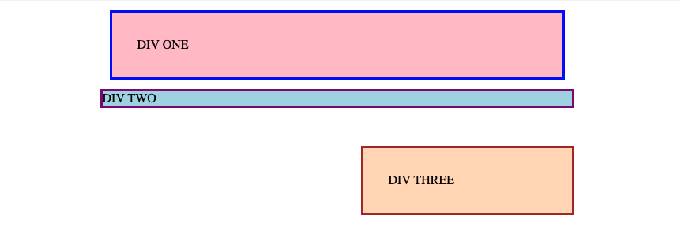

# Margin and Padding 1

> Exercise 01 from The Odin Project - CSS Foundations

## Objective

Practice using margin and padding to control the spacing and positioning of block elements.

## What I practiced

- Using `margin` to create space outside an element
- Using `padding` to create space inside an element
- Understanding the difference between margin and padding
- Using `margin-left: auto` to align an element to the right
- Controlling element size with `width`
- Working with borders and background colors
- Adjusting spacing between different block elements

## Files

- `index.html`
- `styles.css`

## Expected result

## Reference

Exercise from [The Odin Project - CSS Exercises](https://github.com/TheOdinProject/css-exercises/tree/main/foundations/block-and-inline/01-margin-and-padding-1)