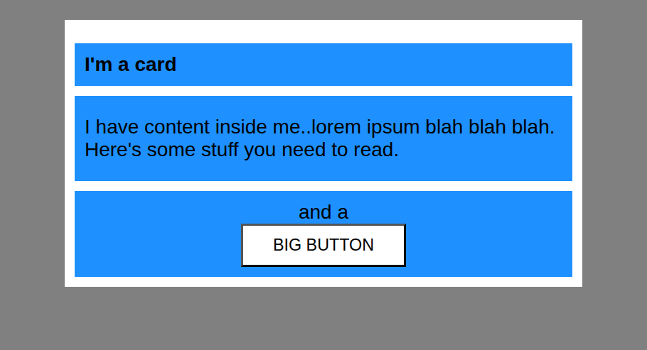

# Margin and Padding 2

> Exercise 02 from The Odin Project - CSS Foundations

## Objective

Practice using margin and padding to control spacing inside and between different sections of a card layout.

## What I practiced

- Using `margin` to create space between elements
- Using `padding` to create space inside elements
- Understanding the difference between margin and padding
- Working with nested block elements
- Controlling spacing in a card layout
- Removing or adjusting default margins from HTML elements
- Using borders and background colors

## Files

- `index.html`
- `styles.css`

## Expected result

## Reference

Exercise from [The Odin Project - CSS Exercises](https://github.com/TheOdinProject/css-exercises/tree/main/foundations/block-and-inline/02-margin-and-padding-2)