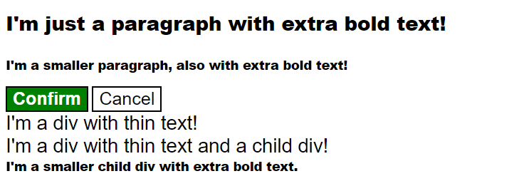

# Cascade Fix

> Exercise 01 from The Odin Project - CSS Foundations

## Objective

Practice understanding how the CSS cascade determines which styles are applied when multiple rules affect the same element.

## What I practiced

- Understanding the CSS cascade
- Comparing selector specificity
- Understanding how inheritance affects styles
- Identifying which CSS rule has priority
- Fixing conflicting styles without changing the HTML structure
- Understanding how the order of CSS rules can affect the final result

## Files

- `index.html`
- `styles.css`

## Expected result

## Reference

Exercise from [The Odin Project - CSS Exercises](https://github.com/TheOdinProject/css-exercises/tree/main/foundations/cascade/01-cascade-fix)