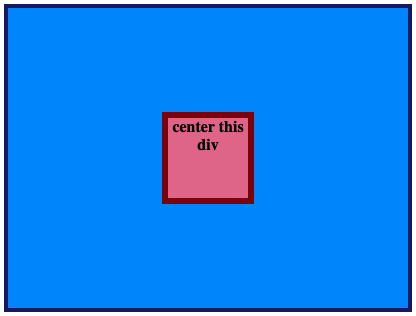

# Flex Center

Exercise from **The Odin Project** to practice centering elements using Flexbox.

## What I practiced

* `display: flex`
* `justify-content`
* `align-items`

## Goal

Center the red div inside the blue container using only Flexbox.

## Desired Outcome

