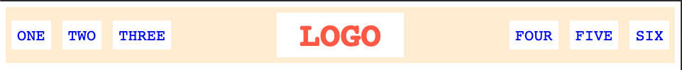
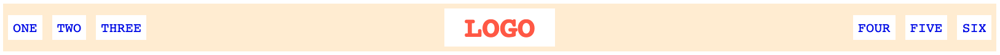

# Flex Header

Exercise from **The Odin Project** to practice creating a responsive header using Flexbox.

## What I practiced

* `display: flex`
* `justify-content`
* `align-items`
* `gap`
* Margin and padding
* Organizing navigation links with Flexbox
* Adapting the layout to different screen widths

## Goal

Create a flexible header with:

* Left navigation links aligned to the left
* The logo centered
* Right navigation links aligned to the right
* Elements vertically centered
* A layout that adapts when the browser width changes

## Desired Outcome

### Narrow

### Wide

