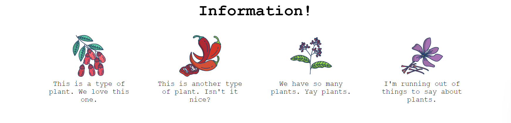

# Flex Information

Exercise from The Odin Project focused on practicing Flexbox to create a common information section layout.

## What I practiced

- Using `display: flex`
- Arranging items horizontally
- Centering elements on the page
- Creating spacing between flex items with `gap`
- Limiting the width of items
- Centering text inside each item
- Adding containers to organize elements with Flexbox

## Reference

The final layout follows the reference image provided by The Odin Project.

