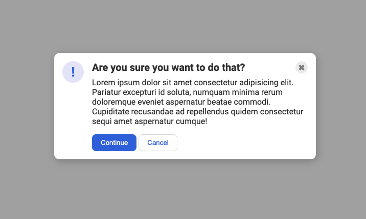

# Flex Modal

Exercise from The Odin Project focused on practicing Flexbox with nested containers.

## What I practiced

- Using `display: flex`
- Creating containers to organize elements
- Aligning items with `align-items`
- Separating elements with `justify-content: space-between`
- Using `gap` for spacing
- Preventing flex items from shrinking with `flex-shrink`
- Structuring a modal with an icon, header, text, and buttons

## Reference

The final layout follows the reference provided by The Odin Project.

