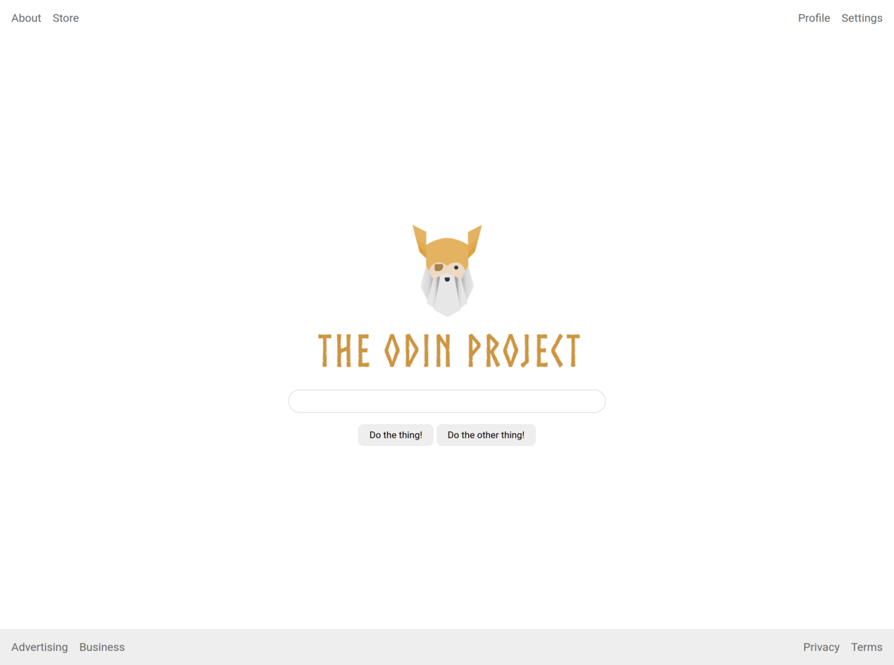

# Flex Layout

Exercise from The Odin Project focused on building a complete page layout using Flexbox.

## What I practiced

- Using `display: flex`
- Organizing the page with `flex-direction: column`
- Using `justify-content: space-between`
- Centering content with `align-items` and `justify-content`
- Using `flex-grow` to fill the remaining space
- Creating horizontal link groups with Flexbox
- Using `gap` to space items
- Removing default list styles
- Structuring a page with a header, main content, and footer

## Reference

The final layout follows the reference provided by The Odin Project.

