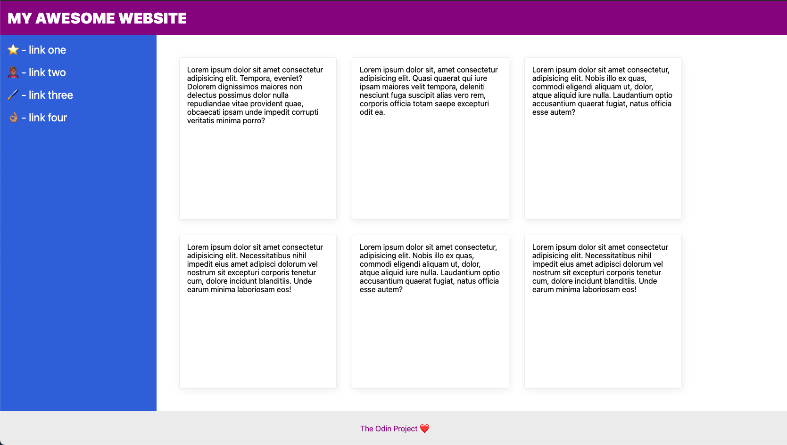

# Flex Layout 2

Exercise from The Odin Project focused on building a more complete page layout with nested Flexbox containers.

## What I practiced

- Using `display: flex` in multiple containers
- Organizing the page with `flex-direction`
- Using `flex-grow` to fill the remaining space
- Preventing elements from shrinking with `flex-shrink`
- Using `flex-wrap` to move items to new rows
- Creating spacing with `gap`
- Adding padding inside containers and cards
- Structuring a layout with header, sidebar, content, and footer
- Creating responsive card layouts with Flexbox
- Understanding how card width affects wrapping behavior

## Reference

The final layout follows the reference provided by The Odin Project.

