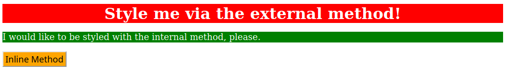

# 01 - CSS Methods

This exercise is part of The Odin Project's CSS Foundations exercises.

The goal was to practice the three different methods of adding CSS to an HTML file:

- External CSS
- Internal CSS
- Inline CSS

## What I practiced

In this exercise, I styled three different elements using a different CSS method for each one:

- `div` → External CSS
- `p` → Internal CSS
- `button` → Inline CSS

I also practiced:

- Linking an external CSS file to HTML
- Using type selectors
- Changing background and text colors
- Changing font size
- Aligning text
- Using `font-weight`

## Files

- `index.html`
- `style.css`

## Expected result

The goal of this exercise was to reproduce the following styling using external, internal and inline CSS:

## Reference

Exercise from [The Odin Project - CSS Exercises](https://github.com/TheOdinProject/css-exercises/tree/main/foundations/intro-to-css/01-css-methods)