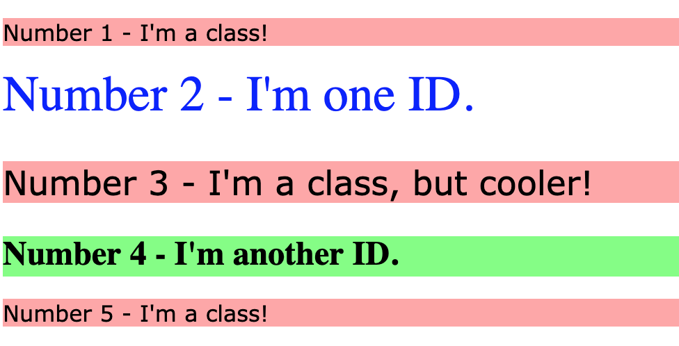

# Class and ID Selectors

> Exercise 02 from The Odin Project - CSS Foundations

## Objective

Practice using class and ID selectors to style specific HTML elements.

## What I practiced

- Using class selectors with `.class`
- Using ID selectors with `#id`
- Applying the same class to multiple elements
- Styling elements differently using IDs
- Understanding the difference between classes and IDs
- Combining selectors with CSS properties such as:
  - `background-color`
  - `color`
  - `font-size`
  - `font-weight`

## Files

- `index.html`
- `styles.css`

## Expected result

## Reference

Exercise from [The Odin Project - CSS Exercises](https://github.com/TheOdinProject/css-exercises/tree/main/foundations/intro-to-css/02-class-id-selectors)