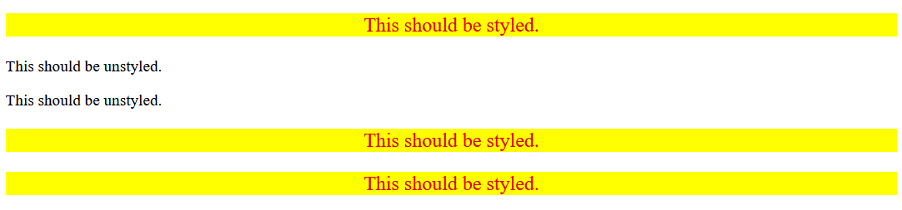

# Descendant Combinator

> Exercise 05 from The Odin Project - CSS Foundations

## Objective

Practice using descendant combinators to select elements based on their position inside other elements.

## What I practiced

- Using descendant combinators with a space between selectors
- Selecting elements inside a specific parent element
- Understanding the difference between selecting a container and selecting elements inside it
- Using class selectors together
- Applying styles only to specific descendant elements

## Files

- `index.html`
- `styles.css`

## Expected result

## Reference

Exercise from [The Odin Project - CSS Exercises](https://github.com/TheOdinProject/css-exercises/tree/main/foundations/intro-to-css/05-descendant-combinator)